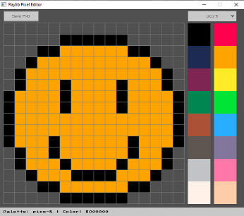
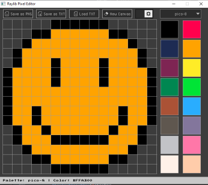

How to set raylib window icon?

Generate resource file for icon

$ windres pixel.rc -o pixel.rc.data --target=pe-x86-64

#### v0.1

#### v0.2

Features:
* Drawing using left mouse button
* Erasing using right mouse button
* Saving as png file using button or Ctrl + S
* Loading color palettes from dropdown (Paint.net format from lospec.com)
* Switching between light/dark theme
* Saving and loading txt file with canvas colors
